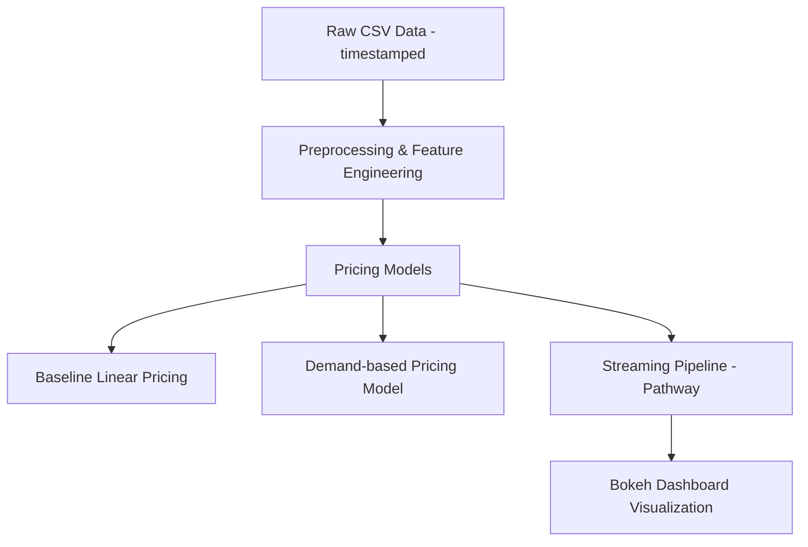

# capstone_proj_2025
# 🚗 Dynamic Parking Pricing System using Pathway and Bokeh

This project demonstrates a real-time **dynamic parking pricing** engine using historical parking lot data. It leverages the [Pathway](https://pathway.com) framework for streaming data processing and **Bokeh** for live visualizations. Pricing is dynamically adjusted based on occupancy, traffic, and queue lengths.

---

## 🛠️ Tech Stack

- **Language:** Python
- **Data Processing:** [Pathway](https://pathway.com)
- **Data Analysis:** Pandas, NumPy
- **Visualization:** Bokeh, Matplotlib
- **Data Source:** CSV (historical parking lot data)

---

## 📊 Architecture Diagram

## 🧠 Project Architecture & Workflow

### 1. **Data Ingestion**
A historical CSV dataset is loaded containing:
- Lot ID, Occupancy, Capacity  
- Queue Length, Vehicle Type  
- Timestamp (combined from date + time fields)  
- Traffic conditions & special day indicators  

---

### 2. **Preprocessing**
- Columns are renamed for clarity  
- A new datetime column `timestamp` is created  
- Data is sorted chronologically  

---

### 3. **Feature Engineering**
- `occ_ratio` = occupancy / capacity  
- `queue_norm` = normalized queue length  
- Traffic conditions mapped from categorical (`low`, `average`, `high`) to numeric  

---

### 4. **Pricing Models**
Two dynamic pricing strategies are implemented:

#### 🔹 Baseline Linear Model:
- Prices increase linearly based on occupancy ratio

#### 🔸 Demand-Based Model:
- A more advanced model that includes:
  - Traffic
  - Queue length
  - Occupancy  
- Tunable parameters: `lambda`, `base_price`  

---

### 5. **Streaming with Pathway**
- Pathway simulates **real-time pricing updates**
- Each new timestamp triggers a price computation and visualization update  

---

### 6. **Visualization**
- A **Bokeh dashboard** visualizes pricing over time  
- Allows **live monitoring** of parking price trends  

---

## 📁 Folder Structure

📦your-project/
┣ 📜README.md
┣ 📜pathway_capstone_prj.ipynb
┣ 📜dataset.csv
┣ 📜requirements.txt

