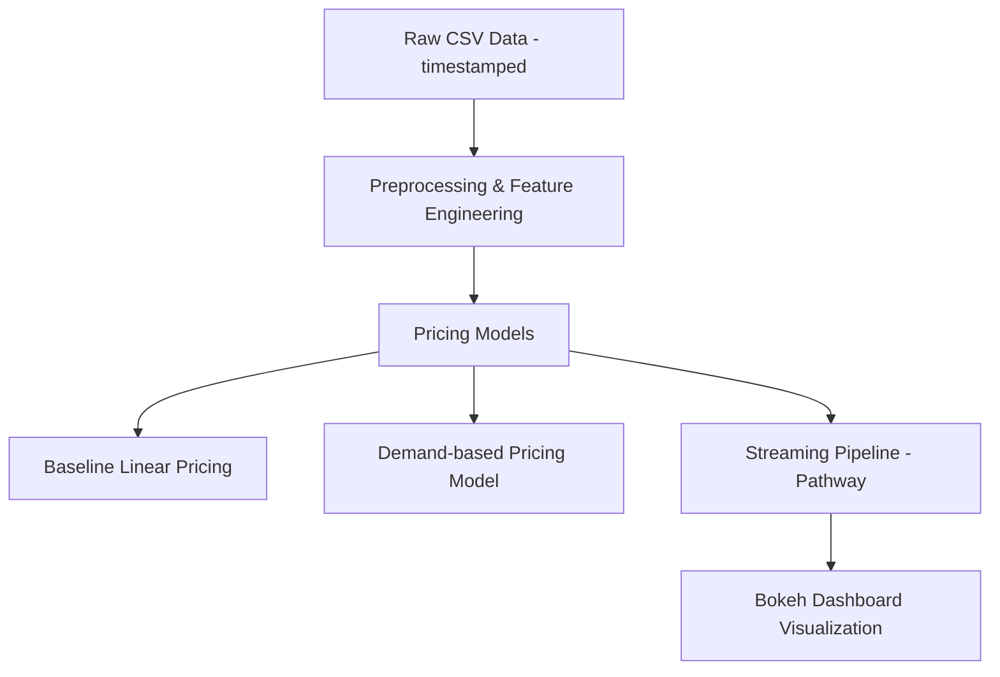

# capstone_proj_2025
# 🚗 Dynamic Parking Pricing System using Pathway and Bokeh

This project demonstrates a real-time **dynamic parking pricing** engine using historical parking lot data. It leverages the [Pathway](https://pathway.com) framework for streaming data processing and **Bokeh** for live visualizations. Pricing is dynamically adjusted based on occupancy, traffic, and queue lengths.

---

## 🛠️ Tech Stack

- **Language:** Python
- **Data Processing:** [Pathway](https://pathway.com)
- **Data Analysis:** Pandas, NumPy
- **Visualization:** Bokeh, Matplotlib
- **Data Source:** CSV (historical parking lot data)

---

## 📊 Architecture Diagram

